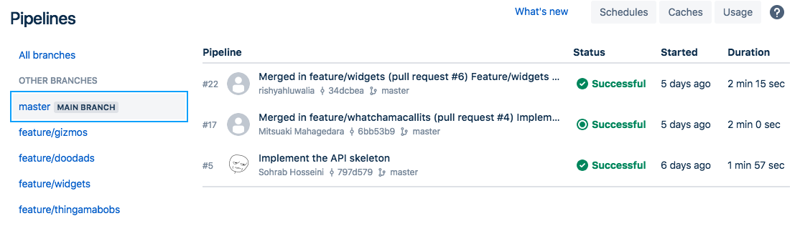
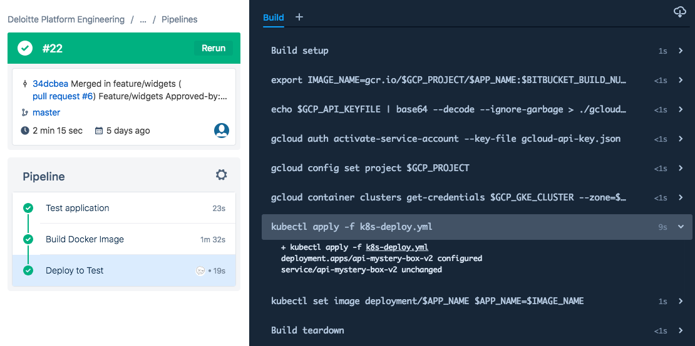
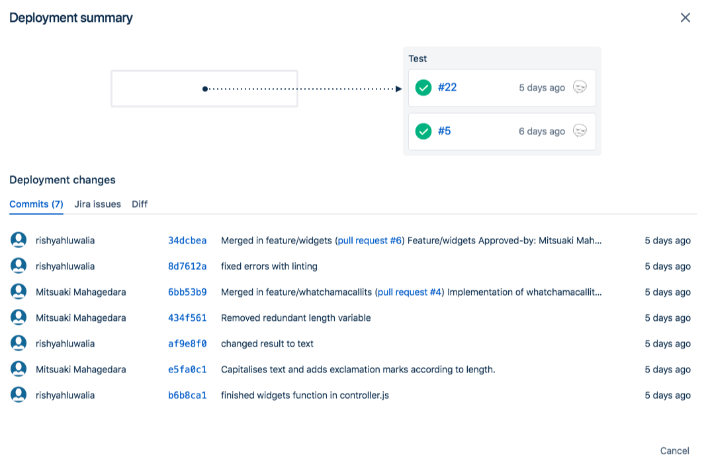

Bitbucket Pipelines
===

* **URL:** [https://bitbucket.org/product/features/pipelines]()
* **Deployment Model:** SaaS
* **Pricing Model:** Build minutes, quota included per subscription tier

Overview
---

Bitbucket Pipelines are built into Bitbucket Cloud and can be used to build and deploy applications stored on Bitbucket Cloud.

All builds take place within Docker containers (including images from private registries). 

`bitbucket-pipelines.yml`, placed at the root of the repo, defines one or more pipelines, each with one or more steps that take place in one or more containers.

See `bitbucket-pipelines.yml` for an example.

Capabilities
---

* **Deployment Support**: Has deployments as a first-class citizen, though limited to `test`, `staging` and `production`
* **Pipeline-as-Code:** `bitbucket-pipelines.yml` YAML file stored at repo's root directory. Cannot be externalised.
* **Task Catalogue:** Only supports script execution
* **Pull Request Build:** Yes
* **Docker Build:** Yes
* **Configuration:** Can define environment variables at repo-level, including secure/encrypted variables
* **Env-specific Configuration:** No
* **Triggers:** Automatic (commits) and manual
* **Artifacts:** Share artifacts between steps
* **Cache:** Caches can be used to reduce build time between builds, e.g. downloaded files or Docker image layers
* **Integration:** Atlassian stack, Slack and webhooks
* **Test Results Viewer:** No

Screenshots
---

